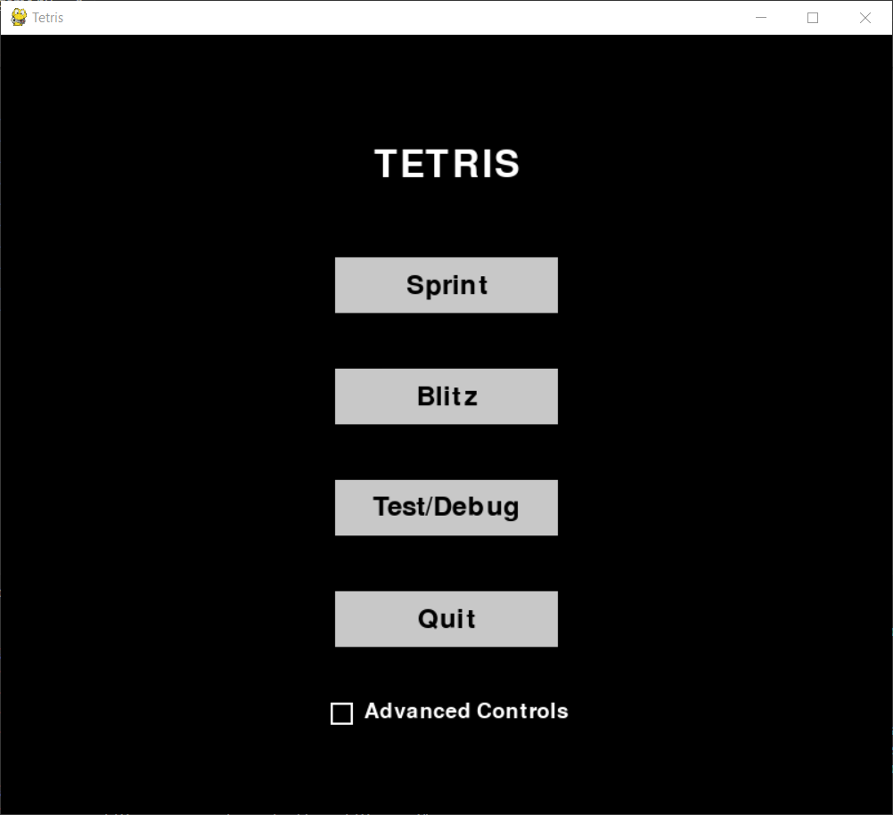
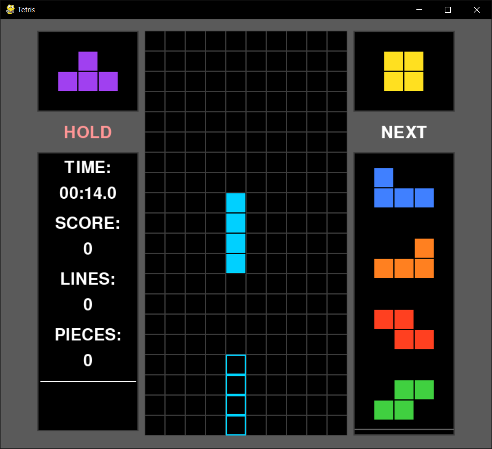

# Teaching an AI to Play Tetris – Cornell College Computer Science and Data Science Undergraduate Capstone Project by Camden Bergquist
## Table of Contents:

- [Resource Briefing](#resource-briefing)
  - [Proposal Paper Abstract](#proposal-paper-abstract)
  - [Introduction](#introduction)
  - [Custom-Built Version of Tetris](#custom-built-version-of-tetris)
    - [Programming Language and IDE](#programming-language-and-ide)
    - [Packages/Libraries](#packageslibraries)
    - [Miscellaneous Resources](#miscellaneous-resources)
  - [AI Creation and Training](#ai-creation-and-training)
    - [Programming Language and IDE](#programming-language-and-ide-1)
    - [Packages/Libraries](#packageslibraries-1)
  - [Statistical Analysis](#statistical-analysis)
    - [Programming Language and IDE](#programming-language-and-ide-2)
    - [Packages/Libraries](#packageslibraries-2)
- [Minimum Viable Product](#minimum-viable-product)
  - [Overview](#overview)
  - [Start Menu](#start-menu)
  - [Gameplay and Controls](#gameplay-and-controls)
  - [End Screen](#end-screen)

## Resource Briefing:
### Proposal Paper Abstract:

This project intends to explore strategic development of the video game Tetris through the application of machine learning. Inspired by the profound impact chess engines have had on chess strategy, it aims to build and train an AI model to play Tetris with an emphasis on strategic insight rather than mere technical optimization. The AI will be developed within a controlled Python environment that mimics standardized "Tetris Guidelines", employing reinforcement learning and genetic algorithms to optimize its decision-making. Data from the AI’s gameplay will then be statistically analyzed to identify patterns and strategies potentially beneficial to human players. Ultimately, this research intends to ask whether AI-driven strategies in Tetris can align with or even challenge existing human gameplay paradigms, highlighting the broader implications of artificial intelligence as a tool for strategic development in closed systems.

### Introduction:

As indicated in the above abstract, the goal of this project is to train a machine learning model, or artificial intelligence (AI) on a self-built version of the classic video game Tetris, with the goal of analyzing and potentially learning from the way the final, fully-trained model makes strategic decisions. The project can be broadly separated into three parts: [building a version of Tetris in Python for the AI to play,](#custom-built-version-of-tetris) [training the AI on the game of Tetris,](#ai-creation-and-training) and [statistically analyzing play data collected from the fully-trained AI.](#statistical-analysis) Each section will use different set of tools, though with partial overlap.

### Custom-Built Version of Tetris:

In order to train an AI to play Tetris, there must first exist a version of Tetris that it can play. While there are innumerable versions of Tetris – both paid and free – on a wide breadth of platofrms, I decided that it would be best to build an in-house version of the game from the ground up. The tools I'm using to do so are as follows:

#### Programming Language and IDE:

I'm using [Python version 3.](https://www.python.org/downloads/) More specifically, the code I've written to date (in the two days since the block started), is in [Python version 3.10.11.](https://www.python.org/downloads/release/python-31011/) This is not the most up-to-date version available to the public, but it *is* the version I already have a bunch of relevant packages installed for. And so, since there's no ostensible benefit to writing it on the most current version, I saw no reason to switch to a more recent release.

The IDE I'm using is [Visual Studio Code,](https://code.visualstudio.com/) as it's a flexible IDE that I'm already familiar with. I'm running it with exstensions relevant to Python and Git, without many other bells and whistles.

#### Packages/Libraries:

There are only two primary packages I'm using for this portion of the project: [Pygame,](https://www.pygame.org/wiki/about) and [NumPy](https://numpy.org/). I'm using Pygame to graphically render the game, and allow a human user to interface with it (primarily for testing purposes), and NumPy is useful for performing mathematical calculations over arrays, which is crucial, as the Tetris play area is a grid upon which pieces move and interact with one another. Tertiary imports I'm using are the default `time` and `random` modules included in Python's base library.

#### Miscellaneous Resources:

There is one additional resource I'm using for this stage of the project, which is the [2009 version of the Tetris Guidelines,](https://archive.org/details/2009-tetris-variant-concepts_202201/2009%20Tetris%20Design%20Guideline/mode/2up) a leaked document outlining certain specifications given by the Tetris Company to developers creating a licensed version of Tetris. It contains a list of rules for gameplay behavior, which will allow me to produce a self-made version of the game which is mechanically faithful to an average, modern iteration of Tetris.

### AI Creation and Training:

#### Programming Language and IDE:

[Identical to the previous section.](#programming-language-and-ide-1) Python is the single most widely-used programming language for machine learning – both in and out of industry – and so the decision to use Python for this project's first section is largely so that it can be seamlessly integrated in to this step.

#### Packages/Libraries:

The primary additional package I plan to use for AI training is [PyTorch,](https://pytorch.org/) which is a package made for AI training and deep learning that will allow me to create and train an AI model to play the game. I'm choosing to use PyTorch because it can accomplish what I need it to and because I'm passingly familiar with it. I spent some time learning how to use it earlier this year during block 4 in preparation for this capstone project.

### Statistical Analysis:

#### Programming Language and IDE:

For statistical analysis, I plan to utilize [R.](https://www.r-project.org/about.html) R is a programming language built primarily by and for statisticians. In this, it's remarkably bad at functional programming, and quite slow, to boot, as it doesn't generally support multithreading. That said it's nearly unparalleled when it comes to data wrangling and statistical analysis. Python has an edge when it comes to deployment of machine learning models, but I'm of the personal opinion that R is more straightforward to use when your goal is more-simple statistical analysis, though admittedly there's a lot of discourse surrounding which is better for different purposes. Nevertheless, while I'm passingly familiar with performing statistical analysis and data manipulation in Python, I'm significantly more experienced at doing so in R, which is the primary reason I'm choosing to switch to it for the third and final leg of the project.

The IDE I'll be using for R is [RStudio,](https://posit.co/downloads/), which is the most common IDE for working in R, as well as the one I'm most familiar with.

#### Packages/Libraries:

The core of my analysis will be performed with two so-called 'universes' of smaller, bundled-together packages: [Tidyverse,](https://www.tidyverse.org/) and its companion [Tidymodels](https://www.tidymodels.org/). Both are frameworks built in R for the purposes of data science, with the latter being more specific than the former. Tidyverse is a framework so all-encompasing when it comes to programming in R that it's difficult to succinctly describe. It handles everything from importing data to manipulating data to analyzing data to plotting data, all under a consistent syntax and near-full interactability between sub-packages. Because R is almost exclusively used for statistics and data science, it's nearly impossible to learn R without also learning to use Tidyverse, and it's essentially the gold standard for doing most anything in R. Tidymodels is a still-in-development framework under the same banner as and developed by the same people behind Tidyverse. Often, packages are written for a single type of statistical modeling, and Tidymodels attempts to rectify this issue by providing a broad list of statistical models to work with, all under the same workflow and syntax. It's also the best tool available for predictive machine-learning models, and while it won't be used to directly learn to play Tetris, it stands to be an invaluable tool at deciphering the potential play patterns exhibited by a completed AI.

## Minimum Viable Product:

### Overview:

My minimum viable product is a Python script fulfilling the first step of the project: a fully-functional version of Tetris, built from the ground up for the AI to play. In order to test its functionalities, it also necessarily accommodates human players.

An executable version of the script, compiled with [PyInstaller,](https://pyinstaller.org/en/stable/) can be found [here.](https://github.com/Camden-Bergquist/Capstone/releases/tag/1.0.0)

### Start Menu:

The mode select screen offers the player two primary gameplay modes in Sprint and Blitz, as well as a debug/practice mode. It also features a button with which to quit the game, and a checkbox labeled 'Advanced Controls'.

In Sprint mode, the player attempts to clear 40 lines as quickly as possible, and the game ends once the 40th line is cleared. In Blitz mode, the player has 3 minutes to score as many points as possible, and the game ends when the time runs out. In both modes, the game also ends if a piece is obstructed from spawning at the top of the play matrix due to the existence of another piece (called a topout). In the debug mode, there is no win condition, but the game still ends if a topout occurs.

The advanced controls checkbox, if made active before starting any gameplay mode, sets the automatic repeat-rate for horizontal piece movement to 0 milliseconds in order to facilitate faster piece movement. If you don't know what this means, then it's best to leave the box unchecked.

### Gameplay and Controls:

The game is operated by keyboard controls, which are as follows:

- `A`: Moves the active piece to the left.
- `D`: Moves the active piece to the right.
- `S`: Soft-drops the active piece, increasing its fall speed.
- `W`: Hard-drops the active piece, immediately moving it as far down as it can go.
- `Left Arrow Key`: Rotates the active piece 90° counter-clockwise.
- `Right Arrow Key`: Rotates the active piece 90° clockwise.
- `Left Shift`: Attempts to swap the active piece with the piece in the hold queue if one exists, or else places it there and spawns the next piece in line if the queue is empty.

There are a few UI indicators of note:
- The text under the hold box will turn red if the hold action is ineligible (as seen above), and white if it is eligible.
- The next queue on the right displays the proceeding five pieces that will be spawned, in order.
- The stats window on the left displays relevant gameplay information. When one or more lines are cleared, the blank space under the horizontal white line will briefly indicate what type of line clear it is (e.g. "Double!").
- In Sprint mode, the tracker for lines cleared will start at 40 and reduce to 0 as lines are cleared, while the timer will start at 00:00.0 and increase as time goes on.
- In Blitz mode, the lines cleared will start at 0 and increase as lines are cleared, while the timer will start at 03:00.0 and decrease as time goes on.
- In the debug mode, the lines cleared will start at 0 and increase as lines are cleared, while the timer will start at 00:00.0 and increase as time goes on.

### End Screen:

Upon the conclusion of a game, whether through successful clearance or a topout, an end screen will appear displaying relevant statistics, as well as offering the player two buttons: one will return them to the mode-select menu, while the other will quit the game.
