# Teaching an AI to Play Tetris – Cornell College Computer Science and Data Science Undergraduate Capstone Project by Camden Bergquist
## Table of Contents:

- [Resource Briefing](#resource-briefing)
  - [Proposal Paper Abstract](#proposal-paper-abstract)
  - [Introduction](#introduction)
  - [Custom-Built Version of Tetris](#custom-built-version-of-tetris)
    - [Programming Language and IDE](#programming-language-and-ide)
    - [Packages/Libraries](#packageslibraries)
    - [Miscellaneous Resources](#miscellaneous-resources)
  - [AI Creation and Training](#ai-creation-and-training)
    - [Programming Language and IDE](#programming-language-and-ide-1)
    - [Packages/Libraries](#packageslibraries-1)
  - [Statistical Analysis](#statistical-analysis)
    - [Programming Language and IDE](#programming-language-and-ide-2)
    - [Packages/Libraries](#packageslibraries-2)
- [Minimum Viable Product](#minimum-viable-product)
  - [Overview](#overview)
  - [Start Menu](#start-menu)
  - [Gameplay and Controls](#gameplay-and-controls)
  - [End Screen](#end-screen)
- [Alpha Release (Sprint Mode)](#alpha-release-sprint-mode)
  - [Preface](#preface-1)
    - [Strategy](#strategy-1)
      - [Pattern Stacking](#pattern-stacking-1)
      - [Hard Drops vs Soft Drops](#hard-drops-vs-soft-drops) 
    - [AI Reward and General Methodology](#ai-reward-and-general-methodology-1)
      - [Reward Methodology](#reward-methodology-1)
      - [Reward Structure](#reward-structure-1)
      - [Decision-Making](#decision-making-1) 
    - [AI Training](#ai-training-1)
    - [Result](#result-1)
    - [Drawbacks](#drawbacks-1)
- [Beta Release (Blitz Mode)](#beta-release-blitz-mode)
  - [Preface](#preface-2)
  - [Strategy](#strategy-2)
    - [Basic Line Clears](#basic-line-clears)
    - [T-Spins](#t-spins)
    - [Clear Bonuses](#clear-bonuses)
      - [Combo Bonus](#combo-bonus)
      - [Back-to-Back Bonus](#back-to-back-bonus)
      - [Perfect Clear Bonus](#perfect-clear-bonus)
    - [Pattern Stacking](#pattern-stacking-2)
  - [Practical Differences from Sprint Mode](#practical-differences-from-sprint-mode)
  - [Addressing the Problem of Computational Complexity](#addressing-the-problem-of-computational-complexity)
  - [AI Reward and General Methodology](#ai-reward-and-general-methodology-2)
    - [Reward Methodology](#reward-methodology-2)
    - [Reward Structure](#reward-structure-2)
    - [Decision-Making](#decision-making-2)
  - [AI Training](#ai-training-2)
  - [Result](#result-2)
  - [Drawbacks](#drawbacks-2)

## Resource Briefing:
### Proposal Paper Abstract:

This project intends to explore strategic development of the video game Tetris through the application of machine learning. Inspired by the profound impact chess engines have had on chess strategy, it aims to build and train an AI model to play Tetris with an emphasis on strategic insight rather than mere technical optimization. The AI will be developed within a controlled Python environment that mimics standardized "Tetris Guidelines", employing reinforcement learning and genetic algorithms to optimize its decision-making. Data from the AI’s gameplay will then be statistically analyzed to identify patterns and strategies potentially beneficial to human players. Ultimately, this research intends to ask whether AI-driven strategies in Tetris can align with or even challenge existing human gameplay paradigms, highlighting the broader implications of artificial intelligence as a tool for strategic development in closed systems.

### Introduction:

As indicated in the above abstract, the goal of this project is to train a machine learning model, or artificial intelligence (AI) on a self-built version of the classic video game Tetris, with the goal of analyzing and potentially learning from the way the final, fully-trained model makes strategic decisions. The project can be broadly separated into three parts: [building a version of Tetris in Python for the AI to play,](#custom-built-version-of-tetris) [training the AI on the game of Tetris,](#ai-creation-and-training) and [statistically analyzing play data collected from the fully-trained AI.](#statistical-analysis) Each section will use different set of tools, though with partial overlap.

### Custom-Built Version of Tetris:

In order to train an AI to play Tetris, there must first exist a version of Tetris that it can play. While there are innumerable versions of Tetris – both paid and free – on a wide breadth of platofrms, I decided that it would be best to build an in-house version of the game from the ground up. The tools I'm using to do so are as follows:

#### Programming Language and IDE:

I'm using [Python version 3.](https://www.python.org/downloads/) More specifically, the code I've written to date (in the two days since the block started), is in [Python version 3.10.11.](https://www.python.org/downloads/release/python-31011/) This is not the most up-to-date version available to the public, but it *is* the version I already have a bunch of relevant packages installed for. And so, since there's no ostensible benefit to writing it on the most current version, I saw no reason to switch to a more recent release.

The IDE I'm using is [Visual Studio Code,](https://code.visualstudio.com/) as it's a flexible IDE that I'm already familiar with. I'm running it with exstensions relevant to Python and Git, without many other bells and whistles.

#### Packages/Libraries:

There are only two primary packages I'm using for this portion of the project: [Pygame,](https://www.pygame.org/wiki/about) and [NumPy](https://numpy.org/). I'm using Pygame to graphically render the game, and allow a human user to interface with it (primarily for testing purposes), and NumPy is useful for performing mathematical calculations over arrays, which is crucial, as the Tetris play area is a grid upon which pieces move and interact with one another. Tertiary imports I'm using are the default `time` and `random` modules included in Python's base library.

#### Miscellaneous Resources:

There is one additional resource I'm using for this stage of the project, which is the [2009 version of the Tetris Guidelines,](https://archive.org/details/2009-tetris-variant-concepts_202201/2009%20Tetris%20Design%20Guideline/mode/2up) a leaked document outlining certain specifications given by the Tetris Company to developers creating a licensed version of Tetris. It contains a list of rules for gameplay behavior, which will allow me to produce a self-made version of the game which is mechanically faithful to an average, modern iteration of Tetris.

### AI Creation and Training:

#### Programming Language and IDE:

[Identical to the previous section.](#programming-language-and-ide-1) Python is the single most widely-used programming language for machine learning – both in and out of industry – and so the decision to use Python for this project's first section is largely so that it can be seamlessly integrated in to this step.

#### Packages/Libraries:

The primary additional package I plan to use for AI training is [PyTorch,](https://pytorch.org/) which is a package made for AI training and deep learning that will allow me to create and train an AI model to play the game. I'm choosing to use PyTorch because it can accomplish what I need it to and because I'm passingly familiar with it. I spent some time learning how to use it earlier this year during block 4 in preparation for this capstone project.

### Statistical Analysis:

#### Programming Language and IDE:

For statistical analysis, I plan to utilize [R.](https://www.r-project.org/about.html) R is a programming language built primarily by and for statisticians. In this, it's remarkably bad at functional programming, and quite slow, to boot, as it doesn't generally support multithreading. That said it's nearly unparalleled when it comes to data wrangling and statistical analysis. Python has an edge when it comes to deployment of machine learning models, but I'm of the personal opinion that R is more straightforward to use when your goal is more-simple statistical analysis, though admittedly there's a lot of discourse surrounding which is better for different purposes. Nevertheless, while I'm passingly familiar with performing statistical analysis and data manipulation in Python, I'm significantly more experienced at doing so in R, which is the primary reason I'm choosing to switch to it for the third and final leg of the project.

The IDE I'll be using for R is [RStudio,](https://posit.co/downloads/), which is the most common IDE for working in R, as well as the one I'm most familiar with.

#### Packages/Libraries:

The core of my analysis will be performed with two so-called 'universes' of smaller, bundled-together packages: [Tidyverse,](https://www.tidyverse.org/) and its companion [Tidymodels](https://www.tidymodels.org/). Both are frameworks built in R for the purposes of data science, with the latter being more specific than the former. Tidyverse is a framework so all-encompasing when it comes to programming in R that it's difficult to succinctly describe. It handles everything from importing data to manipulating data to analyzing data to plotting data, all under a consistent syntax and near-full interactability between sub-packages. Because R is almost exclusively used for statistics and data science, it's nearly impossible to learn R without also learning to use Tidyverse, and it's essentially the gold standard for doing most anything in R. Tidymodels is a still-in-development framework under the same banner as and developed by the same people behind Tidyverse. Often, packages are written for a single type of statistical modeling, and Tidymodels attempts to rectify this issue by providing a broad list of statistical models to work with, all under the same workflow and syntax. It's also the best tool available for predictive machine-learning models, and while it won't be used to directly learn to play Tetris, it stands to be an invaluable tool at deciphering the potential play patterns exhibited by a completed AI.

## Minimum Viable Product:

### Overview:

My minimum viable product is a Python script fulfilling the first step of the project: a fully-functional version of Tetris, built from the ground up for the AI to play. In order to test its functionalities, it also necessarily accommodates human players.

An executable version of the script, compiled with [PyInstaller,](https://pyinstaller.org/en/stable/) can be found [here.](https://github.com/Camden-Bergquist/Capstone/releases/tag/1.0.0)

### Start Menu:

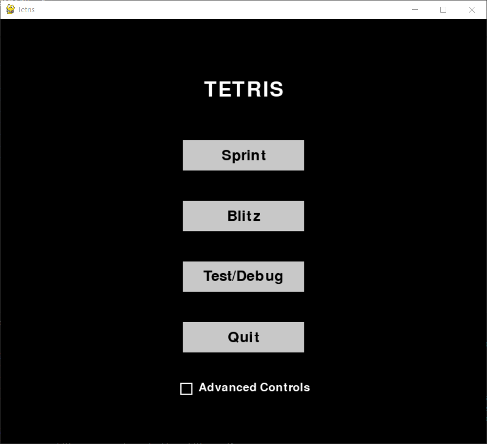

The mode select screen offers the player two primary gameplay modes in Sprint and Blitz, as well as a debug/practice mode. It also features a button with which to quit the game, and a checkbox labeled 'Advanced Controls'.

In Sprint mode, the player attempts to clear 40 lines as quickly as possible, and the game ends once the 40th line is cleared. In Blitz mode, the player has 3 minutes to score as many points as possible, and the game ends when the time runs out. In both modes, the game also ends if a piece is obstructed from spawning at the top of the play matrix due to the existence of another piece (called a topout). In the debug mode, there is no win condition, but the game still ends if a topout occurs.

The advanced controls checkbox, if made active before starting any gameplay mode, sets the automatic repeat-rate for horizontal piece movement to 0 milliseconds in order to facilitate faster piece movement. If you don't know what this means, then it's best to leave the box unchecked.

### Gameplay and Controls:

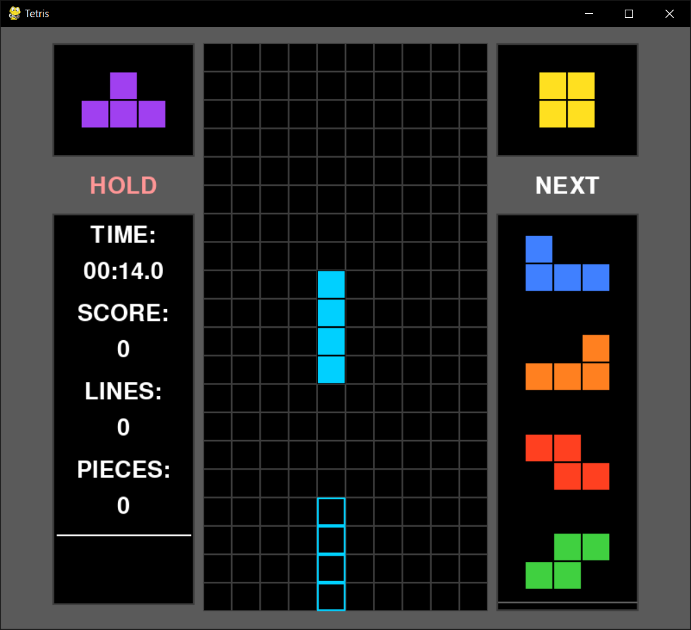

The game is operated by keyboard controls, which are as follows:

- `A`: Moves the active piece to the left.
- `D`: Moves the active piece to the right.
- `S`: Soft-drops the active piece, increasing its fall speed.
- `W`: Hard-drops the active piece, immediately moving it as far down as it can go.
- `Left Arrow Key`: Rotates the active piece 90° counter-clockwise.
- `Right Arrow Key`: Rotates the active piece 90° clockwise.
- `Left Shift`: Attempts to swap the active piece with the piece in the hold queue if one exists, or else places it there and spawns the next piece in line if the queue is empty.

There are a few UI indicators of note:
- The text under the hold box will turn red if the hold action is ineligible (as seen above), and white if it is eligible.
- The next queue on the right displays the proceeding five pieces that will be spawned, in order.
- The stats window on the left displays relevant gameplay information. When one or more lines are cleared, the blank space under the horizontal white line will briefly indicate what type of line clear it is (e.g. "Double!").
- In Sprint mode, the tracker for lines cleared will start at 40 and reduce to 0 as lines are cleared, while the timer will start at 00:00.0 and increase as time goes on.
- In Blitz mode, the lines cleared will start at 0 and increase as lines are cleared, while the timer will start at 03:00.0 and decrease as time goes on.
- In the debug mode, the lines cleared will start at 0 and increase as lines are cleared, while the timer will start at 00:00.0 and increase as time goes on.

### End Screen:

Upon the conclusion of a game, whether through successful clearance or a topout, an end screen will appear displaying relevant statistics, as well as offering the player two buttons: one will return them to the mode-select menu, while the other will quit the game.

## Alpha Release (Sprint Mode):

### Preface:

A large portion of the AI's training on Sprint mode, as well as the embedded images and explanations in this section of the readme, were heavily inspired by a [2013 blog post written by Yiyuan Lee](https://codemyroad.wordpress.com/2013/04/14/tetris-ai-the-near-perfect-player/) in which he tackles a very similar problem, building an AI to play Tetris with JavaScript.

Additionally, a majority of the embeds in this section are images and gifs taken in [Four-tris,](https://github.com/fiorescarlatto/four-tris) which is a Tetris training tool that allowed me to easily create explanatory diagrams.

### Strategy:

In Sprint mode, the player's objective is to clear a certain, predefined number of lines as quickly as possible. Most commonly, this number is 40, called a '40-line Sprint', but you might also occasionally see 80- and 100-line sprints. In the context project, you should assume a 40-line Sprint any time Sprint mode is referred to, unless explicitly stated otherwise. The major goal of training an AI on Sprint mode is to see if it identifies any of the sorts of human optimizations or general strategic tenets while learning the game.

#### Pattern Stacking:

Inevitably, when presented with a goal like this, players will attempt to optimize their piece-stacking strategy to make things easier on themselves, both in terms of deciding where to place pieces, and in terms of the number of player actions required of them (i.e., the number of times a piece is moved horizontally before it's placed). These stacking strategies all have a certain pattern or orientation to them, and are accordingly referred to as 'pattern stacking'.

 

  
<table>
  <tr>
    <td align="center">
      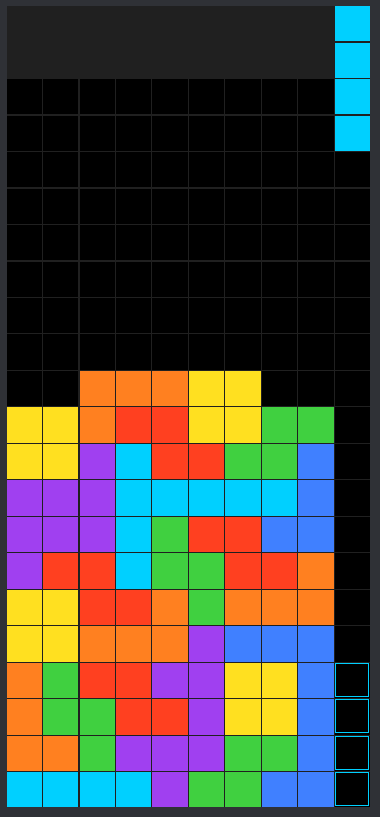 
      <em>Example of 9–0 Stacking.</em>
    </td>
    <td style="width: 100px;"></td> <!-- spacer cell -->
    <td align="center">
      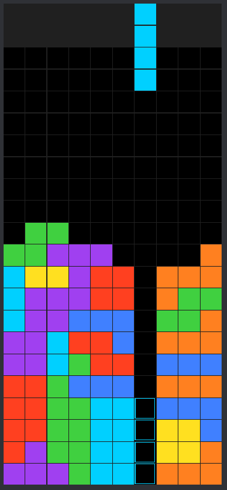 
      <em>Example of 6–3 Stacking.</em>
    </td>
  </tr>
</table>

 

All forms of pattern stacking used in Sprint mode follow a simple formula— one 'well', which is the column reserved for the I-piece (the long piece), with the rest of the columns filled in with pieces. All Sprint-based pattern stacking can be described with the notation 'X–Y', where X is the number of filled columns to the left of the well, and Y is the number on the right. Pictured above are the two most commonly-seen forms of pattern stacking: 9–0, and 6–3. 9–0 – keeping everything in a big stack and placing the well to the right side (0–9, if the well is on the left) – should be familiar to any person reading this who's played Tetris before, and is perhaps the single most common and straightforward strategic idea in all of Tetris. 6–3 (or its mirror 3–6), on the other hand, is a more advanced stacking method that places the well in-between stacks to either side. It is the most popular form of pattern stacking among advanced players, largely because it minimizes the number of player inputs (keystrokes, button presses) needed to place pieces, which, in turn, increases clear speed.

#### Hard Drops vs Soft Drops:

 

  
<table>
  <tr>
    <td align="center">
      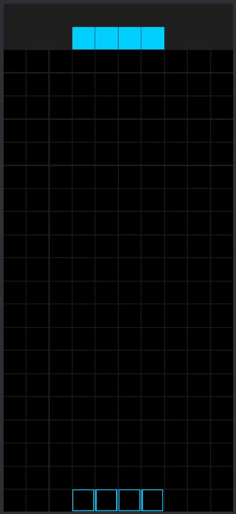 
      <em>An I-Piece getting hard-dropped, then soft-dropped.</em>
    </td>
  </tr>
</table>

 

There are two types of piece placements, or 'drops', available to the player: soft drops, and hard drops. A soft drop increases the speed at which the piece falls to the bottom of the play matrix. While it moves downward, it can still be rotated, as well as moved horizontally. The player also retains the choice to swap the current piece with the held piece so long as the soft-dropped piece hasn't locked into place yet, buying them more time as the held piece spwans at the top of the matrix. Hard drops skip this process entirely, and instead instantly lock the piece into place as far downwards as it can move. Put in simpler terms, a hard drop instantly places the current piece in the location shown by the outline below it (called the 'ghost piece').

Needless to say, hard drops are faster than soft drops, and so are preferred in every Tetris game mode that places importance on placement speed (which is most, if not all of them). There are only two reasons for a player to perform a soft drop. The first is to fix a mistake they made by accidentally creating a piece overhang, while the second is to score additional points in modes where certain types of soft drops award higher scores. Neither of these are relevant in Sprint mode. There are no points to be considered, and since it's slower it's considered a time-wasting mistake if even a moderately-skilled human player is forced to soft drop in a Sprint. 

**Because of this, the AI is only allowed to hard drop when playing Sprint mode.** There's no reason to consider objectively sub-optimal decisions, after all. As a bonus, it significantly reduces the number of actions it needs to choose from, which consequently reduces the computational complexity of training and gameplay loops.

### AI Reward and General Methodology:

#### Reward Methodology:

When training an AI, it must be given a reward metric, or reward state, which tells it how well it performed a task upon completion (or failure)— a goal. Ideally, it would be possible to use the same goal that humans do for Sprint mode, which is clearing 40 lines as quickly as possible. Doing so is problematic, however, as an AI can make decisions really, *really* quickly, making it difficult to realistically compare its performance to humans. Moreover, this project isn't actually concerned with the speed at which an AI can place pieces – it's no surprise that computers are faster at calculations than humans – but with strategy— the decision-making process behind each piece placement. By rewarding the AI for clear speed, we wouldn't be teaching it to place pieces more efficiently, but to make decisions that increase its own decision-making speed, i.e., placing pieces in such a way that it has to consider fewer possibilities for each piece, which is nearly the opposite of this project's goal.

Instead, the AI is being trained with the task of **reducing the number of total pieces placed upon winning the game.** The thought process here is simple— the fewer pieces a player needs to place, the quicker their clear time will be. Pieces placed, then, becomes a way of effectively comparing an AI agent to a human player, because it's a metric that doesn't rely on a shared perception of time, and instead asks the player to be as line-clear-efficient as possible with their placements.

#### Reward Structure:

Each time the AI's game ends – whether by topping out or by clearing 40 lines – it's awarded a point value associated to how well it performed. If it managed to clear all 40 lines, then its score is equal to the negation of the number of pieces it placed before winning. For example, if it cleared 40 lines after placing 112 pieces, then its final score would be -112. Its ultimate goal is to maximize this score towards the theoretical limit of -100 (it's mathematically impossible to win a 40-line sprint in less than 100 pieces).

If, instead, the AI loses by topping out, then it recieves additional rewards based on the number of lines cleard and the number of pieces placed, minus a given offset:

 

  

 

The offset of -550 allows the AI to be rewarded for placing more pieces if it loses – ensuring that it attempts to survive longer – as well as for line clears, without ever running the risk of a loss being considered 'better' or more rewarding than a win.

#### Decision-Making:

At first, I attempted to train a neural-network model on the game, but, after little success, I went in search of other potential avenues. In a [2013 blog post on a similar project,](https://codemyroad.wordpress.com/2013/04/14/tetris-ai-the-near-perfect-player/) author Yiyuan Lee describes a linear, heuristic-based model that assigns weights to four heuristics for possible piece placements, which I liked the look of and decided to implement for myself.

The process is as follows: 

First, the AI compiles a list of all possible hard drops for a given piece (as well as the held piece, so long as it's of a different type than the active piece).

 

  
<table>
  <tr>
    <td align="center">
      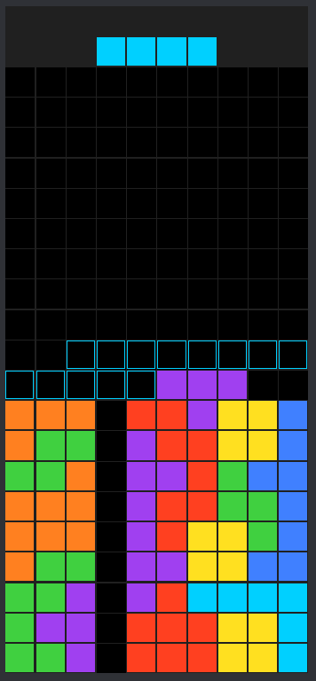 
      <em>All possible horizontal drop locations for the I-piece.</em>
    </td>
    <td style="width: 100px;"></td> <!-- spacer cell -->
    <td align="center">
      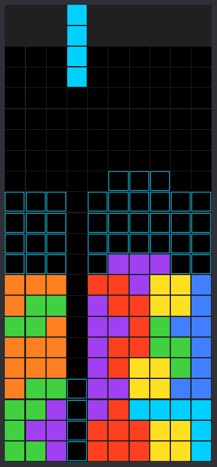 
      <em>All possible vertical drop locations for the I-piece.</em>
    </td>
  </tr>
</table>

 

Then, it evaluates each option by multiplying each of its current weights by one of the four heuristics calculated on a drop location: number of holes present, number of lines cleared, aggregate column height, and the sum of the absolute differences between adjacent column heights (bumpiness). These weights start out as random values, and the idea is that, over time, the AI will learn how much 'importance' to assign to each heuristic.

 

<table>
  <tr>
    <td align="center">
      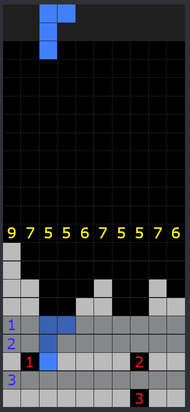 
      <em>Red numbers are holes, blue are lines cleared, and yellow are column heights.</em>
    </td>
  </tr>
</table>

 

Finally, it chooses the option with the highest total heuristic score given its current weights, before executing that placement.

 

  
<table>
  <tr>
    <td align="center">
      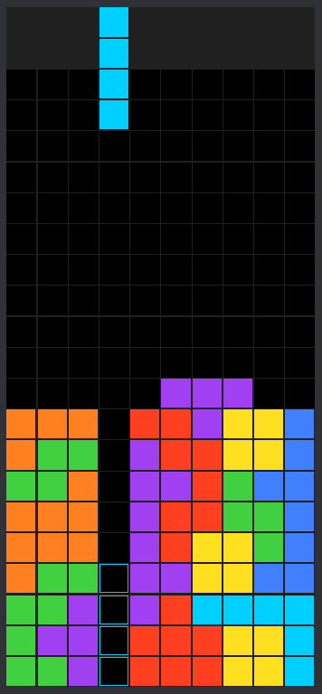 
      <em>It chooses what it considers the 'best' move.</em>
    </td>
    <td style="width: 100px;"></td> <!-- spacer cell -->
    <td align="center">
      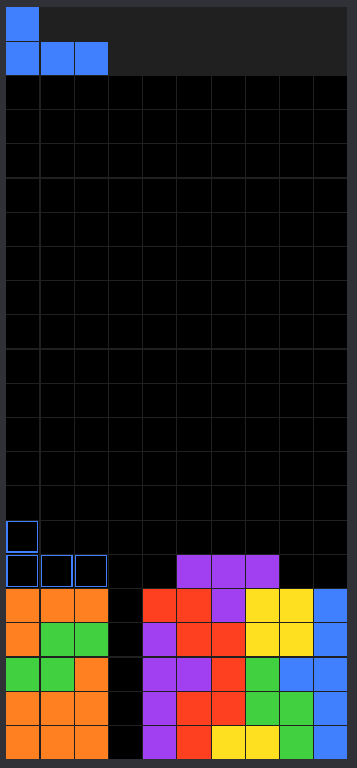 
      <em>The piece is placed and the cycle is restarted.</em>
    </td>
  </tr>
</table>

 

**Crucially, it's important to note that, as a linear model, it relies on no observation state, and has no real form of 'memory' like a neural network might. It's also currently restricted to looking at the current piece and held piece, with no form of lookahead whatsoever.** The lack of lookahead isn't a restriction of the model itself, but rather of the limited time I have based on the scope of this project. I'm about to move on to training for Blitz mode, and don't have the time to dedicate to properly implementing lookahead for a linear model like this, even if I think it would be equal parts valuable and interesting to see.

### AI Training:

The AI was trained on a linear, evolution-based model. An evolution model trains entire batches, or 'populations, of agents at a time, and only iteratively learns after each agent in a population is finished. This is in contrast to a standard reinforcmenet-learning model, which typically learns after each 'episode' (in our case, an episode is a full game of Sprint mode, played to either completion or top-out). Broadly speaking, the way an evolutionary algorithm works is by training an entire population of agents, measuring how well they do, and then creating an entirely new population of agents based off of the traits exhibited by the best performers in the previous generation. Evolutionary algorithms are known for their robustness, and excel at learning to solve broad, chaotic problems with large amounts of potential game states, which makes them perfect for a game like Tetris.

### Result:

The current best-performing model uses the weights -1.65, 0.71, -1.25, and -0.39 for the aggregate height, lines cleared, holes, and bumpiness heuristics, respectively. This means that it evaluates a piece placement by counting the value for each heuristic, before passing them through the following function to get a final score:

 

  

 

These heuristics were acquired by training the AI on 3600 games (population size of 60, search size of 60). The weights being primarily negative, especially for aggregate height, means that the heuristic score for a placement is almost always a negative value. This doesn't really impact anything, however, as the AI will still choose to play the maximum value (negative value closest to 0) in the common case that no positive scores exist for a position.

Finally, below is a game of Sprint mode successfully cleared by the AI in 101 pieces:

 

  

 

### Preliminary Analysis:

A 101-piece clear is on the high-performing side of what the trained AI is capable of, seeing as it's only a single piece off of a 'perfect' game of Sprint. In training, the AI consistently clears 40 lines after placing between 100~115 pieces, with a median somewhere around 106 or 107. Needless to say, this is a very promising result, and I'm happy with the outcome. That said, I'm also of the belief that it's capable of performing much better. As stated in the [Decision-Making](#decision-making) section, the AI currently only makes decisions based on either the current piece or the held piece. This classifies it as what's known as a 'greedy algorithm'— one which prioritizes immediate reward over future reward, except that in our case, it isn't that the AI doesn't value future reward, but that it isn't aware moves past the current one exist in the first place. While I doubt any form of lookahead would do much to improve it's play for the majority of piece placements, I *do* believe that it would have a marked effect on the final few pieces it places before a clear, allowing it to more consistently minimize the number of pieces it has to place before clearing that last, 40th line.

In a development that I expected, the AI cares next to nothing for any form of pattern stacking. The way it stacks is much closer to what's called 'freeform stacking', or else 'Korean stacking', named after the region of players who popularized the technique. The idea behind Korean stacking is to eschew any sort of consistent pattern, and instead place each piece in the best place a player can imagine. An idea that's almost exactly reflected in the way the AI was trained. While not a very popular method of stacking among humans, it's considered theoretically sound in that there's no real strategic flaw to be had. In fact, it's considered more optimal than pattern stacking when concerned only with piece placements. Its main drawbacks compared to a pattern such as 6–3 are twofold: it takes more actions per piece placement on average, and it takes more thought to properly execute. The latter, in particular, is a human weakness that the AI doesn't have to grapple with. If I have extra time down the line, I'd like to explore training the AI to win a 40-line sprint in the fewest game actions to see if it settles on any sort of favored pattern, but I'm not sure I'll be able to do so before the block is up.

All that said, while the human stacking-strategy the AI's decision-making most closely reflects is Korean stacking, it's still different in its own right. Consider the situation below.

 

  
<table>
  <tr>
    <td align="center">
      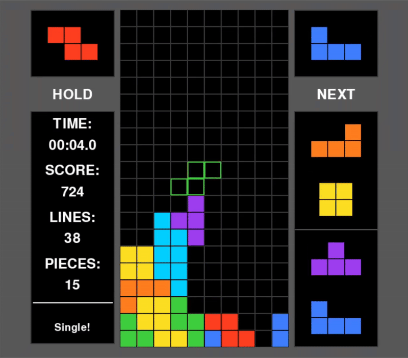 
      <em>A seeming mistake.</em>
    </td>
    <td style="width: 100px;"></td> <!-- spacer cell -->
    <td align="center">
      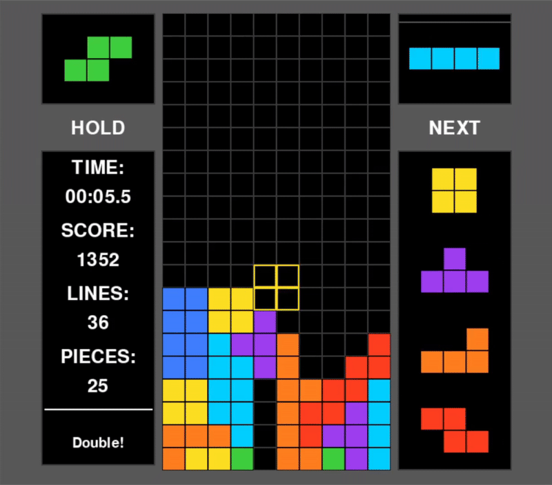 
      <em>The AI resolves this by building to the right.</em>
    </td>
  </tr>
</table>

 

A human player adhering to a Korean-stacking strategy would never make the move above, as it significantly limits future piece placements and blocks off the well present in the matrix. The AI refutes that it's a problem in the first place, and instead continues to stack on the right side of the matrix like nothing happened. This works well for it, of course, seeing as it managed a victory in 101 pieces, though admittedly, the T-piece placement featured above is likely an objective mistake, human agent or otherwise, as it reduces the 'acceptable' placements for future pieces by preventing the player (who doesn't ever want to soft-drop in Sprint mode) from hard-dropping a piece in column 5. This behavior is likely something that would be resolved, to the point of being completely eliminated, with proper, multi-depth lookahead, and so lookahead once again seems to be the limiting factor for this heuristic-based model.

## Beta Release (Blitz Mode):

### Preface:

### Strategy:

#### Basic Line Clears:

#### T-Spins:

#### Clear Bonuses:

##### Combo Bonus:

##### Back-to-Back Bonus:

##### Perfect Clear Bonus:

#### Pattern Stacking:

### Practical Differences from Sprint Mode:

### Addressing the Problem of Computational Complexity:

### AI Reward and General Methodology:

#### Reward Methodology:

#### Reward Structure:

#### Decision-Making:

### AI Training:

### Result:

### Drawbacks:

